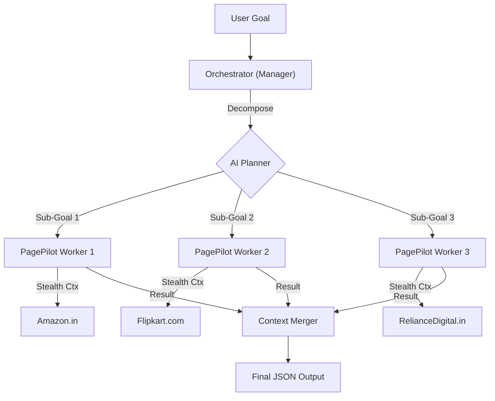

# PagePilot 🚀

**The Autonomous, Self-Healing Browser Agent for High-Scale Web Automation.**

[](https://www.npmjs.com/package/@pagepilot/pagepilot)
[](https://opensource.org/licenses/MIT)

PagePilot is a next-generation automation library built on top of **Playwright**. It transforms brittle, selector-based scripts into resilient, autonomous agents capable of navigating complex websites, bypassing anti-bot protections, and essentially "thinking" their way through tasks.

---

## 🌟 Why PagePilot?

Traditional web automation is fragile. One CSS change breaks your entire suite.
**PagePilot** solves this by combining **computer vision (accessibility trees)** with **Large Language Models (LLMs)** to understand the page like a human user.

### Key Features

*   **🛡️ Self-Healing Selectors**
    *   Never hardcode a CSS selector again. PagePilot analyzes the DOM semantically. If the UI changes, the agent adapts instantly without breaking the test.

*   **⚡ Auto-Parallelization (Manager-Worker Architecture)**
    *   **The Orchestrator:** Give PagePilot a complex goal like *"Compare iPhone prices on Amazon, Flipkart, and Reliance Digital"*.
    *   **Magic:** It automatically decomposes the request into sub-goals and spins up parallel browser contexts to execute them simultaneously, slashing execution time.

*   **🥷 Stealth Mode**
    *   Built-in integration with `puppeteer-extra-plugin-stealth` and `playwright-extra`.
    *   Automatically evades bot detection systems (Cloudflare, Akamai) by mimicking human fingerprints and behavior.

*   **🧠 Human-Like Interaction**
    *   **Smart specific Scroll:** Uses "Human Scroll" logic to trigger lazy-loading elements just like a real user.
    *   **Passive Scanning:** Constantly scans the viewport for goal completion (e.g., verifying a price appeared) to exit tasks early and save resources.

---

## 🏗️ Architecture

PagePilot functions on a **Manager-Worker** model to ensure scalability and isolation.



---

## 📦 Installation

```bash
npm install @pagepilot/pagepilot
```

## 🚀 Usage

### 1. Basic Setup (Single Task)

Perfect for scraping, testing, or simple automation.

```typescript
import { chromium } from 'playwright-extra';
import StealthPlugin from 'puppeteer-extra-plugin-stealth';
import { Orchestrator } from '@pagepilot/pagepilot';

// 1. Setup Stealth Browser
chromium.use(StealthPlugin());
const browser = await chromium.launch({ headless: false });
const page = await browser.newPage();

// 2. Initialize Agent
const agent = new Orchestrator(page, {
  provider: 'portkey',
  apiKey: process.env.PORTKEY_API_KEY!
});

// 3. Execute Semantic Goal
const result = await agent.execute(
  "Go to amazon.in, search for 'Sony WH-1000XM5', and extract the price."
);

console.log(result);
// Output: { price: "₹24,990" }

await browser.close();
```

### 2. Auto-Parallel Execution

The real power of PagePilot. Send one complex prompt, and watch it swarm.

```typescript
const goal = `
  Compare the price of 'iPhone 15 128GB' on:
  1. Amazon.in (save as amazon_price)
  2. Flipkart.com (save as flipkart_price)
  3. Croma.com (save as croma_price)
`;

// The Orchestrator detects multiple distinct tasks and runs them in parallel
const results = await agent.execute(goal);

console.table(results);
```

---

## 🔧 Configuration

PagePilot uses **Portkey** for robust AI gateway management. This ensures reliability, retries, and observability for your AI calls.

Create a `.env` file:

```env
PORTKEY_API_KEY=your_portkey_api_key
PORTKEY_VIRTUAL_KEY=optional_virtual_key
```

---

## 🤝 Contributing

We welcome contributions! Please see our [Contributing Guide](CONTRIBUTING.md) for details.

1.  Fork the repo
2.  Create your feature branch (`git checkout -b feature/amazing-feature`)
3.  Commit your changes (`git commit -m 'feat: Add some amazing feature'`)
4.  Push to the branch (`git push origin feature/amazing-feature`)
5.  Open a Pull Request

## 📄 License

Distributed under the MIT License. See `LICENSE` for more information.
